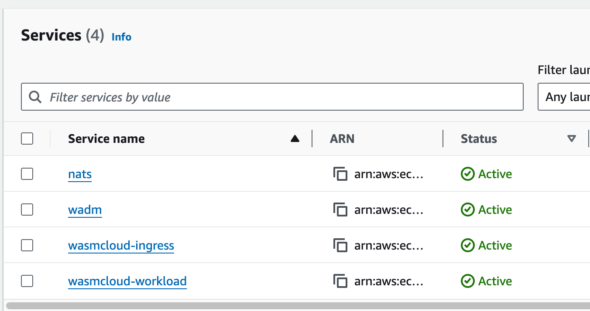
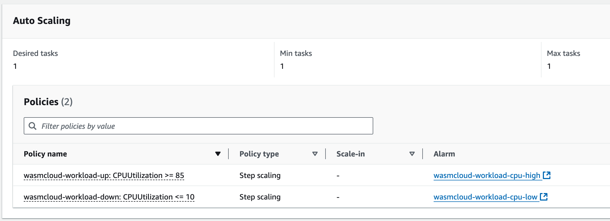
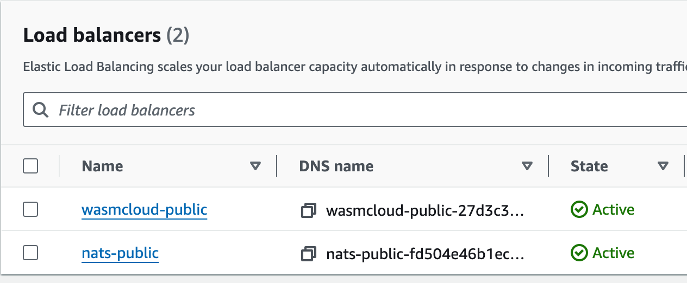

# WasmCloud on ECS Fargate





Infrastructure:

- 1 NATS
  - Public Load Balancer exposing port 4222 ( `wash` access )
  - Ephemeral Volume for Jetstream
- 1 wasmCloud wadm
- 1 wasmCloud worker instance
  - Autoscaling based on CPU usage
  - Capacity: 1 min, 1 max ( configurable )
- 1 wasmCloud ingress instance
  - Public Load Balancer exposing port 80 ( `http` access )

## Setup

Create a file named `terraform.tvfars` with the following content:

```hcl
aws_region              = "us-east-2"

# If using aws cli profile (SSO), set it here
aws_profile             = "enterprise-dev"

# CIDRs for wash access ( default none )
nats_allowed_cidrs      = ["45.74.99.13/32"]

# CIDRs for http access ( default 0.0.0/0 )
wasmcloud_allowed_cidrs = ["45.74.99.13/32"]
```

Apply the terraform configuration:

```shell
terraform init

terraform apply
```

## wash access

```shell
export WASMCLOUD_CTL_HOST="$(terraform output -raw nats_lb)"

wash get inventory
```

## external access

Once `wash` is setup, deploy a sample application:

```shell
wash app deploy ./hello-world-wadm.yaml
```

Access the application:

```shell
export WASMCLOUD_LB="$(terraform output -raw wasmcloud_public_lb)"
curl -i http://$WASMCLOUD_LB
```
