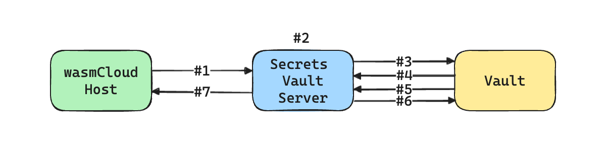

# secrets-vault

[wasmCloud Secrets][wasmcloud-secrets] Server implementation for HashiCorp Vault that uses the [JWT Auth method][vault-jwt-auth] to fetch secrets stored in the [KV Secrets Engine - version 2][vault-kv2-secrets].

## How it works

When the Secrets Vault Server starts, it does the following:

1. Subscribes to NATS messages on the configured wasmCloud secrets subject (`wasmcloud.secrets.v1alpha1.<service-name>` by default) for Server Xkey requests on `<wasmcloud-secrets-subject>.server_xkey` and for Secret Requests from wasmCloud hosts on `<wasmcloud-secrets-subject>.get`.
2. Starts serving a JWKS endpoint (on `http://<jwks-address-flag>/.well-known/keys`) that lists JWKs used to sign the authentication requests sent to Vault for fetching the secrets described in incoming `SecretRequest`s.

### Life of a `SecretRequest`



When the server receives a `SecretRequest` via the NATS subject (`wasmcloud.secrets.v1alpha1.<service-name>.get`), it runs through the following order of operations:

1. wasmCloud Host sends a `SecretRequest` to Secrets Vault Server.
2. Secrets Vault Server attempts to decrypt the `SecretRequest` using it's own XKey and the requesting wasmCloud Host's public key attached to the request and proceeds to validate the attached Host and Entity claims.
    * Entity refers to either a Component or Provider depending on which the Host is making the SecretRequest for.
3. Secrets Vault Server calls Vault with the [`jwt` authentication method][vault-jwt-auth] using a JWT derived from the claims attached to the `SecretRequest`.
4. Vault validates that the authentication JWT has been signed with keys listed on the JWKS endpoint served by the Secret Vault Server and then matches the attached claims in JWT against a set of pre-configured [bound claims configuration][vault-bound-claims].
5. Once Vault has successfully validated the authentication JWT and succesfully matched it against a role, Vault responds with a client token for the Secrets Vault Server to use for fetching secrets.
6. Secrets Vault Server will then attempt to access the secret by referencing `name` and optionally the `version` fields stored in the `SecretRequest`. The secrets engine mount path and role name to be used for fetching the secrets can be configured in the `policies` entry associated with the given secret.
  * See the [Referencing Secrets](#referencing-secrets) section below for an example.
7. Once Secrets Vault Server is able to successfully access the secret from Vault, it will serialize the stored secret data along with the Vault's secret version in a `SecretResponse`, encrypt the resulting payload using it's configured XKey and the wasmCloud Host's public key so that only the wasmCloud host that requested the secret can decrypt it and respond back to the requesting wasmCloud Host with the encrypted payload.

## How to use it

### Install with Helm

If you are looking to run Secrets Vault Server as part of an existing Kubernetes-based deployment, you can easily deploy it using the bundled [Helm chart][helm-chart] using the following command:

```shell
helm install wasmcloud-secrets-vault oci://ghcr.io/wasmcloud/charts/secrets-vault

For detailed information on the available configuration options, please see the [Helm chart README][helm-chart].

### Configuring Vault

In order for Secrets Vault Server to work as intended, it will need the following to be pre-configured on the Vault Server it's talking to:

1. Vault Server will need to an instance of the [JWT auth method enabled][vault-jwt-auth-enabled] specifically for the Secrets Vault Server.
2. The JWT auth method will need to be configured to with the [`jwks_url`][vault-jwks-url] configured to point at the JWKS endpoint exposed by the Secrets Vault Service (configured via `--jwks-address` flag `SV_JWKS_ADDRESS` environment variable). Optionally you can also include a default_role for the backend

An example of configuring the above steps might look like this:

```shell
# Enable jwt auth method at provided path
$ vault auth enable -path=jwt jwt

# Configure jwt auth to point it's jwks_url at the JWKS endpoint provided by the Secrets Vault Server
# Please note that the Secrets Vault Server needs to be running in order for Vault to verify the endpoint.
$ vault write auth/jwt/config jwks_url="http://localhost:3000/.well-known/keys"

# Create a named role with configuration from demo-role.json, see below for example.
$ vault write auth/jwt/role/demo-role @demo-role.json 
```

Example `demo-json.role`:

```json
{
  "role_type": "jwt",
  "policies": ["demo-role-policy"],
  "bound_audiences": "Vault",
  "bound_claims": {
    "application": ["rust-hello-world", "rust-http-kv", "tinygo-hello-world"]
  },
  "user_claim": "sub"
}
```

Once you have enabled the jwt auth method and created a named role, you will also need to create the `demo-role-policy` policy:

```shell
# Create the policy named demo-role-policy with the contents from stdin:
$ vault policy write demo-role-policy - << EOF
# Dev servers have version 2 of KV secrets engine mounted by default, so will
# need this path to grant permissions:
path "secret/data/*" {
  capabilities = ["create", "update", "read"]
}
EOF
```

### Referencing Secrets

With the role created and configured, you can now reference any secrets you write on the default `secret` path.

To configure a wadm application to use policies, you will need to add `policies` section in your wadm manifest:

```yaml
# ... beginning of the manifest ...
spec:
  policies:
    - name: vault-secrets-example
      type: policy.secret.wasmcloud.dev/v1alpha1
      properties:
        backend: 'vault'
        role_name: 'demo-role'
        mount_path: 'jwt'
# ... rest of the manifest ...
```

And then in your component or provider's `properties` section you will need the a `secrets` section that references the policy:

```yaml
# ... rest of the component or provider definition ...
      secrets:
      - name: 'secret-name-in-your-code'
        source:
          policy: 'vault-secrets-example'
          key: 'path/to/secret/in/vault'
# ... rest of the manifest ...
```

[helm-chart]: https://github.com/wasmCloud/wasmCloud-contrib/blob/main/secrets/secrets-vault/charts/secrets-vault/README.md
[vault-bound-claims]: https://developer.hashicorp.com/vault/docs/auth/jwt#bound-claims
[vault-jwks-url]: https://developer.hashicorp.com/vault/api-docs/auth/jwt#jwks_url
[vault-jwt-auth]: https://developer.hashicorp.com/vault/docs/auth/jwt#jwt-authentication
[vault-jwt-auth-enabled]: https://developer.hashicorp.com/vault/docs/auth/jwt#configuration
[vault-kv2-secrets]: https://developer.hashicorp.com/vault/docs/secrets/kv/kv-v2
[vault-kv2-usage]: https://developer.hashicorp.com/vault/docs/secrets/kv/kv-v2#usage
[wasmcloud-secrets]: https://github.com/wasmCloud/wasmCloud/issues/2190
